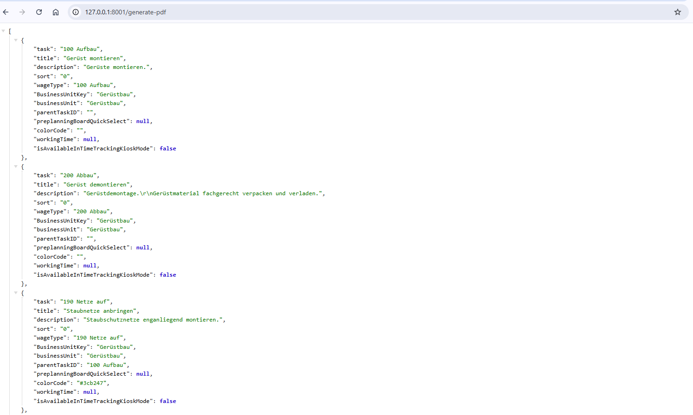
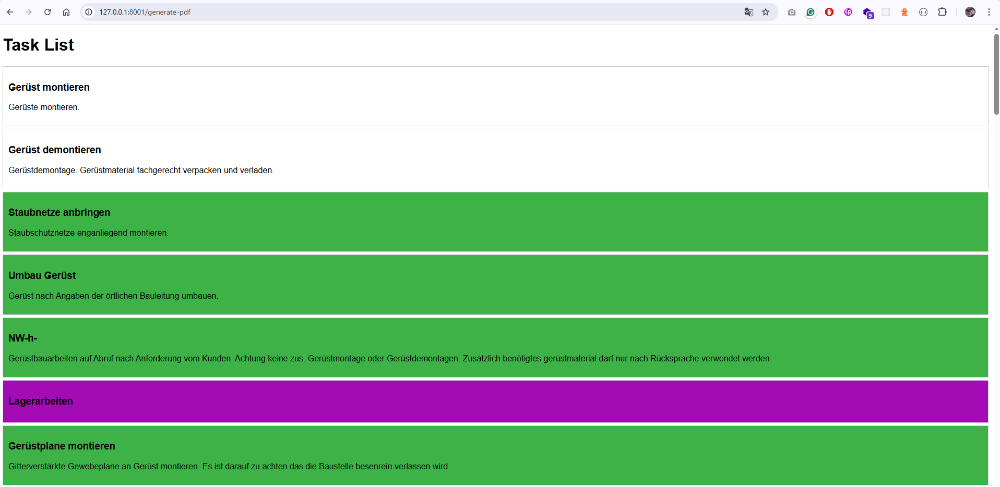
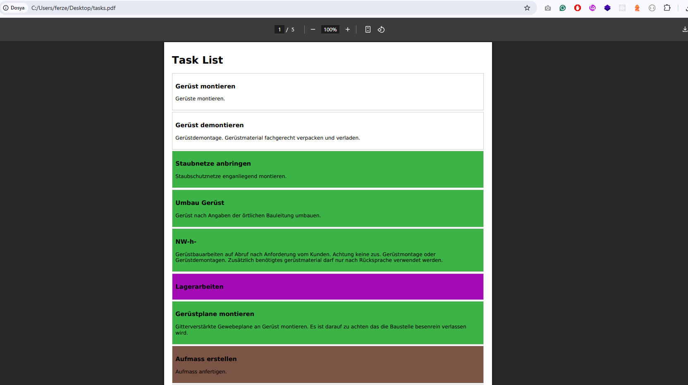

# Laravel HTML to PDF Service

A web service that authenticates users, fetches task data from an external API, dynamically generates HTML, and converts it to a PDF using `wkhtmltopdf`. The project is containerized with Docker for easy deployment.

---

## Features

- **User Authentication:**
    - Accepts `username` and `password` via a GET request.
    - Retrieves an authentication token from the external API.

- **Task Data Fetching:**
    - Uses the access token to request task data from `https://api.baubuddy.de/dev/index.php/v1/tasks/select`.

- **HTML Generation & Data Presentation:**
    - Dynamically generates an HTML document from the API response.
    - Displays task details including `task`, `title`, `description`, and `colorCode`.
    - Uses `colorCode` visually (background color of the task section).

- **PDF Generation & Download:**
    - Uses `wkhtmltopdf` to convert the generated HTML into a PDF.
    - The PDF is returned as a downloadable response.

- **Dockerized Setup:**
    - Contains a `Dockerfile` and `docker-compose.yml` for easy deployment.
    - Includes Nginx, PHP, and MySQL services.

---

## Technologies Used

- **Backend:** Laravel 10 (PHP 8.2)
- **PDF Generation:** wkhtmltopdf
- **Authentication:** API Token Authentication
- **Database:** MySQL 8.0 (if needed for future extensions)
- **Containerization:** Docker, Docker Compose
- **Web Server:** Nginx
- **Service Layer:** Baubuddy API Integration
- **Templating:** Blade Templates

---

## Project Architecture

The project follows a structured architecture with a service layer handling API interaction.

- **Controller:** `PdfController.php` (Handles request processing and PDF generation)
- **Service:** `BaubuddyApiService.php` (Handles API authentication and data fetching)
- **View:** `tasks.blade.php` (Generates HTML for PDF conversion)
- **Configuration:** `config/services.php` and `config/snappy.php`
- **Routing:** `web.php`

---

## Installation & Setup

### Prerequisites

- Docker & Docker Compose installed on your system
- Git

### Step 1: Clone the Repository

```bash
git clone https://github.com/fvarli/laravel-html-to-pdf.git
cd laravel-html-to-pdf
```

### Step 2: Set Up Environment Variables

Copy the `.env.example` file to `.env`:

```bash
cp .env.example .env
```

Modify the following environment variables:

```bash
BAUBUDDY_API_URL=url
BAUBUDDY_API_LOGIN_URL=login_url
BAUBUDDY_API_AUTHORIZATION=authorization
BAUBUDDY_API_USERNAME=username
BAUBUDDY_API_PASSWORD=password
WKHTMLTOPDF_BINARY=/usr/bin/wkhtmltopdf
```

### Step 3: Build and Run Containers

```bash
docker-compose up -d --build
```

This will start:
- Laravel application (`app` container)
- MySQL database (`db` container)
- Nginx web server (`webserver` container)

### Step 4: Install Dependencies & Migrate Database

```bash
docker-compose exec app composer install
docker-compose exec app php artisan key:generate
docker-compose exec app php artisan migrate --seed (if needed for future extensions)
```

### Step 5: Access the API

You can access the application at:
- `http://localhost:8001/`
- Generate PDF: `http://localhost:8001/generate-pdf`

---

## API Endpoints

### Generate PDF

**Request:**
```bash
GET /generate-pdf
```

**Response:**
- A downloadable PDF file containing task details.

---

## Docker Configuration

### Docker Compose Setup (`docker-compose.yml`)

The setup includes three services:

- **`app` (Laravel Application)**: PHP 8.2 + wkhtmltopdf
- **`db` (MySQL Database)**: Stores data if needed
- **`webserver` (Nginx)**: Routes requests to Laravel

---

### Screenshots

Both Postman Collection and Environment files are available in the `resources/docs/postman` directory.





---

### PDF File

📄 [Downloaded PDF File](resources/files/tasks.pdf)

---

## Contact

- Website: [www.ferzendervarli.com](https://www.ferzendervarli.com/)
- GitHub: [github.com/fvarli](https://github.com/fvarli)
- LinkedIn: [linkedin.com/in/fvarli](https://www.linkedin.com/in/fvarli)
